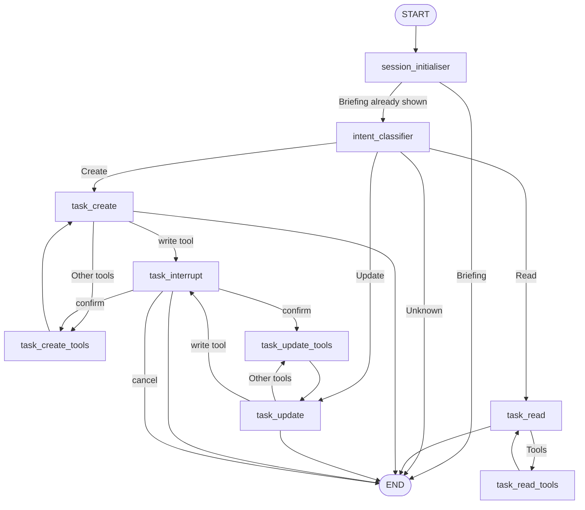

# Graph Architecture

## Overview

The graph is a LangGraph `StateGraph` with explicit node routing per intent. Nodes orchestrate
LLM decisions, while tools execute side effects such as repository calls. Tool execution is
managed through `ToolNode`

## Topology



## Agent State

| Field | Type | Default | Owner | Notes |
| --- | --- | --- | --- | --- |
| `messages` | `list` (reducer: `add_messages`) | `[]` | All nodes | Full conversation history; reducer merges by message id |
| `intent` | `Literal['task_create', 'task_read', 'task_update', 'unknown']` | `unknown` | Intent classifier | Drives the routing decision after classification |
| `confirmation` | `bool` | `None` | `None` | Interrupt node | Set when the user confirms a write action |
| `cancelled` | `bool` | `None` | `None` | Interrupt node | Set when the user cancels a write action |
| `briefing_shown` | `bool` | `False` | Session initialiser | Prevents re-emitting the daily briefing in the same session |

## Tools

| Domain | Tool | Description |
| --- | --- | --- |
| Task CRUD | `create_task` | Create a new task in the repository |
| Task CRUD | `get_task` | Retrieve a task by id |
| Task CRUD | `list_tasks` | List tasks using structured filters |
| Task CRUD | `update_task` | Update task fields |
| Task CRUD | `delete_task` | Soft-delete a task by id |
| Filter builders | `parse_date_range` | Parse a natural language date range into ISO bounds |
| Filter builders | `build_overdue_filter` | Build a filter for overdue tasks |
| Filter builders | `build_today_filter` | Build a filter for tasks planned for today |
| Filter builders | `build_unscheduled_filter` | Build a filter for tasks with deadlines but no plan |
| Filter builders | `build_stale_filter` | Build a filter for tasks with stale planned dates |
| Briefing | `get_daily_briefing_data` | Return `{overdue,today,upcoming,unscheduled,stale}` arrays of task dicts |
| Calendar links | `generate_calendar_link` | Build a Google Calendar link from task details |

### Tool Allocation

| Node | Tool set |
| --- | --- |
| `task_create` | `create_task`, `new_task`, `format_task_preview`, `generate_calendar_link` |
| `task_update` | `get_task`, `list_tasks`, `update_task`, `delete_task`, `parse_date_range`, `format_task_preview`, `generate_calendar_link` |
| `task_read` | `list_tasks`, `get_task`, `parse_date_range`, `build_overdue_filter`, `build_today_filter`, `build_unscheduled_filter`, `build_stale_filter`, `format_task_preview` |
| `session_initialiser` | `get_daily_briefing_data`, `format_task_preview` |

## Routing Logic

- `session_initialiser` emits a briefing once per session
- `intent_classifier` sets `state['intent']` based on the user prompt
- `route_by_intent` sends the state to `task_read`, `task_create`, `task_update`, or `END`
- `should_continue` inspects the last message and routes to the tool node if tool calls are
  present; write tools (`create_task`, `update_task`, `delete_task`) route to the interrupt
- `should_save_task` decides whether to proceed with the write tools after confirmation

## Session Initialiser

The `session_initialiser` node runs at session start, emits a single briefing message, and sets `briefing_shown=True` in state. The daily briefing returns five sections: `overdue`, `today`, `upcoming`, `unscheduled`, and `stale`. The next user message triggers intent classification in a new invocation

## Checkpointing

The graph and the ReAct agent are each compiled with a checkpointer so
conversation state (including pending interrupts) survives across turns of
the same thread. Callers must pass a thread id to retain state between turns:

```python
result = graph.invoke(state, config={"configurable": {"thread_id": "session-1"}}, version="v2")
```

Which checkpointer backs this is decided by `assistant_agent.graph.checkpointer.build_checkpointer`,
given whatever URL `Config.database_url` resolves to. That resolution is
driven by `ENVIRONMENT` (`assistant_agent.config.Config`), which picks one of
three Postgres connection strings rather than one `DATABASE_URL` being
swapped/overridden per context:

| `ENVIRONMENT` | URL used | Typical context |
| --- | --- | --- |
| `production` | `DATABASE_URL` | The `assistant-agent` container — docker-compose overrides `ENVIRONMENT` to `production` there, so this resolves against the `postgres` service hostname |
| `development` (default) | `DEV_DATABASE_URL` | Running the app directly on the host, outside Docker (`localhost`, via the compose service's published port) |
| `test` | `TEST_DATABASE_URL` | `pytest`, which forces `ENVIRONMENT=test` — points at a separate `assistant_agent_test` database so tests never touch development data. See README.md's "Running Tests" section |

- When the resolved URL is set, a `PostgresSaver` is used, backed by a `psycopg_pool.ConnectionPool`
- When it's unset, an `InMemorySaver` is used instead — state is lost on restart

## Design Rationale

An explicit node topology was chosen over a single ReAct agent because it:

- Separates intent classification from execution
- Makes tool usage and routing decisions traceable in LangSmith
- Aligns with the thesis focus on explicit orchestration and evaluation

## Monitoring: LangSmith

This project uses LangSmith to capture execution traces for LangGraph runs in non-test
scenarios. Each node invocation (intent classifier, tool loops, and interrupt responses)
appears as a separate span, which makes routing decisions and tool usage easy to inspect
and cite in the thesis

### Setup

1. Create a LangSmith account and an API key
2. Add the following to your environment (or .env file):

```
LANGCHAIN_TRACING_V2=true
LANGCHAIN_ENDPOINT=https://api.smith.langchain.com
LANGCHAIN_API_KEY=your-langsmith-key-here
LANGCHAIN_PROJECT=assistant_agent
```

### How It Works

LangSmith is enabled through the `LANGCHAIN_TRACING_V2` environment variable. When it is
`true`, LangChain automatically records traces for every graph run, including:

- The input prompt and messages flowing through the graph
- Node-level routing decisions (intent classifier, task CRUD, briefing)
- Tool call inputs and outputs

Tests disable tracing to keep the suite isolated and deterministic. Traces are only
recorded for real runs launched from scripts or a REPL

Trace example: https://eu.smith.langchain.com/public/b80c96ad-810a-432a-a5fc-67193223ab40/r
