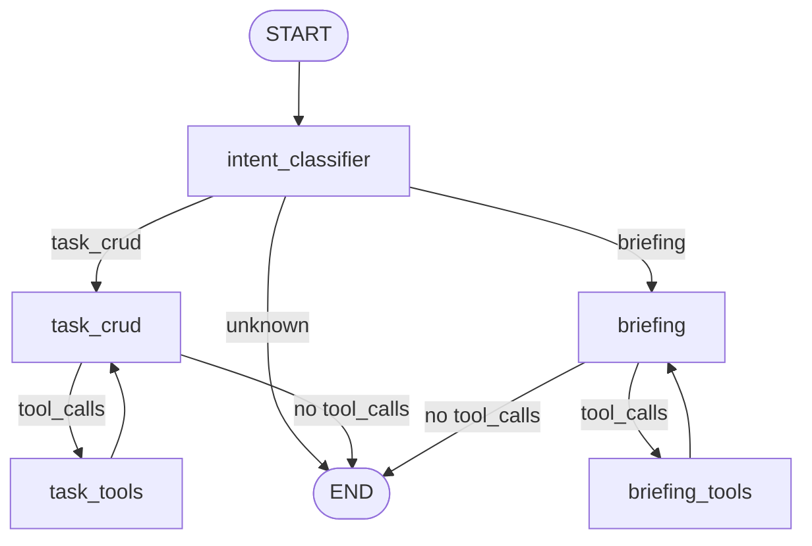

# Graph Architecture

## Overview

The graph is a LangGraph `StateGraph` with explicit node routing. Nodes orchestrate
LLM decisions, while tools execute side effects such as repository calls or
calendar link generation. Tool execution is managed through `ToolNode`.

## Topology



## Agent State

| Field | Type | Default | Owner | Notes |
| --- | --- | --- | --- | --- |
| `messages` | `list` (reducer: `add_messages`) | `[]` | All nodes | Full conversation history; reducer merges by message id. |
| `intent` | `Literal['task_crud', 'briefing', 'unknown']` | `unknown` | Intent classifier | Drives the routing decision after classification. |

## Tools

| Domain | Tool | Description |
| --- | --- | --- |
| Task CRUD | `create_task` | Create a new task in the repository. |
| Task CRUD | `get_task` | Retrieve a task by id. |
| Task CRUD | `list_tasks` | List tasks using structured filters. |
| Task CRUD | `update_task` | Update task fields (including rescheduling). |
| Task CRUD | `delete_task` | Soft-delete a task by id. |
| Filter builders | `parse_date` | Parse a natural language date into an ISO datetime. |
| Filter builders | `parse_date_range` | Parse a natural language date range into ISO bounds. |
| Filter builders | `build_overdue_filter` | Build a filter for overdue tasks. |
| Filter builders | `build_today_filter` | Build a filter for tasks planned for today. |
| Filter builders | `build_unscheduled_filter` | Build a filter for tasks with deadlines but no plan. |
| Briefing | `get_daily_briefing_data` | Summarize overdue, today, upcoming, and unscheduled tasks. |
| Calendar | `generate_calendar_link` | Generate a quick-add calendar link. |

## Routing Logic

- `intent_classifier` sets `state['intent']` based on the user prompt.
- `route_by_intent` sends the state to `task_crud`, `briefing`, or `END`.
- `should_continue` inspects the last message and routes to the tool node if
  tool calls are present, otherwise it ends the run.

## MemorySaver Checkpointing

The graph is compiled with `InMemorySaver` for short-lived session memory.
Callers must pass a thread id to retain state between turns:

```python
result = graph.invoke(state, config={"configurable": {"thread_id": "session-1"}})
```

This allows consecutive turns to reuse the stored message history. The
in-memory checkpointer is suitable for development and thesis experiments; a
persistent saver (for example, SQLite) can replace it later.

## Design Rationale

An explicit node topology was chosen over a single ReAct agent because it:

- Separates intent classification from execution.
- Makes tool usage and routing decisions traceable in LangSmith.
- Aligns with the thesis focus on explicit orchestration and evaluation.
