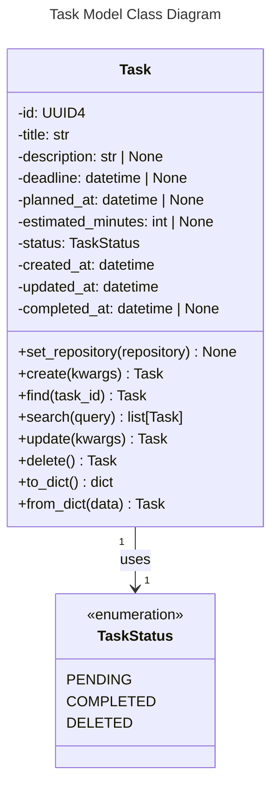
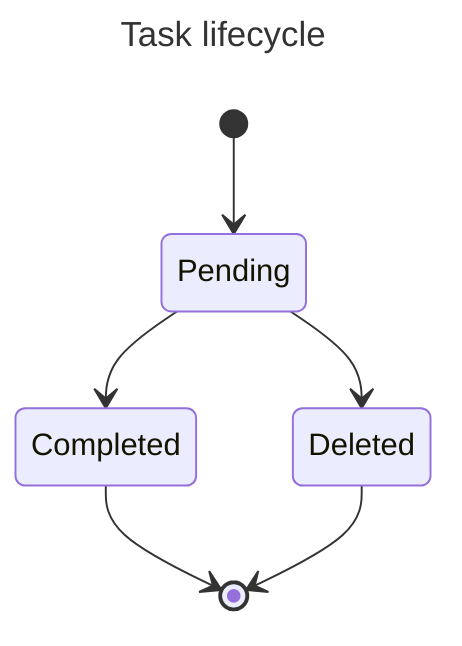

# Models

This document describes the core data models used in the Assistant Agent.

## Task

The `Task` model represents a single task in the time management assistant system.

### Overview

The Task entity is the fundamental unit of work in the system. It manages task metadata, lifecycle states, and automatic validation/transformation of task data.

### Fields

| Field | Type | Required | Description |
|-------|------|----------|-------------|
| `id` | UUID4 | No | Unique identifier. Auto-generated on creation. Immutable. |
| `title` | str | Yes | Task title. Must not be empty after stripping whitespace. |
| `description` | str \| None | No | Optional detailed description of the task. |
| `deadline` | datetime \| None | No | Optional deadline time for task completion. |
| `planned_at` | datetime \| None | No | Optional planned time when the task will be worked on. |
| `estimated_minutes` | int \| None | No | Estimated effort in minutes. Must be positive. Automatically rounded to nearest 15-minute increment. |
| `status` | TaskStatus | No | Current lifecycle state. Defaults to `PENDING`. |
| `created_at` | datetime | No | Timestamp when the task was created. Immutable. |
| `updated_at` | datetime | No | Timestamp of last update. Auto-updated on modifications. |
| `completed_at` | datetime \| None | No | Timestamp when the task was marked as completed. Automatically managed. |

### Class Diagram



### TaskStatus Enum

Defines the possible lifecycle states of a task:

- **PENDING** (`'pending'`): Default state. Task is awaiting completion.
- **COMPLETED** (`'completed'`): Task has been completed.
- **DELETED** (`'deleted'`): Task has been deleted/archived.



### Validation Rules

The Task model enforces the following validation rules:

1. **Title Validation**: Title must not be empty after stripping whitespace.
2. **Estimated Minutes Validation**: If provided, must be a positive integer (> 0).
3. **Completed Date Consistency**: 
   - If status is `COMPLETED` and `completed_at` is None, it's automatically set to current UTC time.
   - If status is not `COMPLETED` but `completed_at` is not None, it's automatically cleared.
4. **Estimated Minutes Rounding**: Estimated minutes are automatically rounded up to the nearest 15-minute increment.
5. **Title Stripping**: Title is automatically stripped of leading/trailing whitespace.

### Usage Examples

#### Creating a Task

```python
from assistant_agent.models.task import Task

# Basic task creation
task = Task.create(title="Implement feature X")

# Task with full details
task = Task.create(
    title="Submit report",
    description="Submit quarterly report to management",
    deadline=date(2026, 4, 15, tzinfo=UTC),
    estimated_minutes=120
)
```

#### Updating a Task

```python
# Update task fields (except id and created_at which cannot be modified)
updated_task = task.update(
    status=TaskStatus.COMPLETED,
    description="Updated description"
)
```

#### Marking a Task as Deleted

```python
deleted_task = task.delete()  # Sets status to DELETED
```

#### Serialization

```python
# Convert to dictionary
task_dict = task.to_dict()

# Create from dictionary
task = Task.from_dict(task_dict)
```

#### Repository-based Queries

When a repository is set, you can query tasks directly from storage:

```python
# Find a single task by ID
task = Task.find("123e4567-e89b-12d3-a456-426614174000")

# Search all tasks
all_tasks = Task.search()

# Search with query filter (e.g., all pending tasks)
pending_tasks = Task.search({"status": "pending"})

# Multiple filter criteria
completed_reports = Task.search({
    "status": "completed",
    "description": "report"
})
```

Note: `find()` and `search()` require a repository to be set, otherwise they raise `ValueError`.

### Important Behaviors

- **Auto-rounding**: Estimated minutes are rounded to 15-minute intervals for consistent scheduling.
- **Immutable Fields**: `id` and `created_at` cannot be modified after creation.
- **Auto-completion Tracking**: When a task is marked as completed, the completion timestamp is automatically recorded.
- **Updated Tracking**: The `updated_at` field is automatically updated whenever the task is modified via the `update()` method.

### Repository Integration

The Task model is designed to work with repositories for data persistence. Key methods:

- **`set_repository(repository)`**: Inject a repository instance (typically done at application startup)
- **`find(task_id)`**: Retrieve a task by ID from the repository
- **`search(query=None)`**: Query tasks with optional filtering

Example initialization:

```python
from assistant_agent.models.task import Task
from assistant_agent.repository import JsonRepository

# At application startup
repo = JsonRepository(file_name="tasks.json")
Task.set_repository(repo)

# Now all create/update/delete operations persist automatically
task = Task.create(title="Task")  # Automatically saved
updated = task.update(title="Updated")  # Changes saved
deleted = task.delete()  # Deletion saved

# And queries work
task_from_storage = Task.find(task.id)
all_tasks = Task.search()
```

**Automatic Persistence**: When a repository is set, `create()` and `update()` automatically persist changes to storage. If no repository is set, tasks work normally without persistence (no errors raised).

For detailed information on repositories, see [Repository Pattern](Repository.md).
