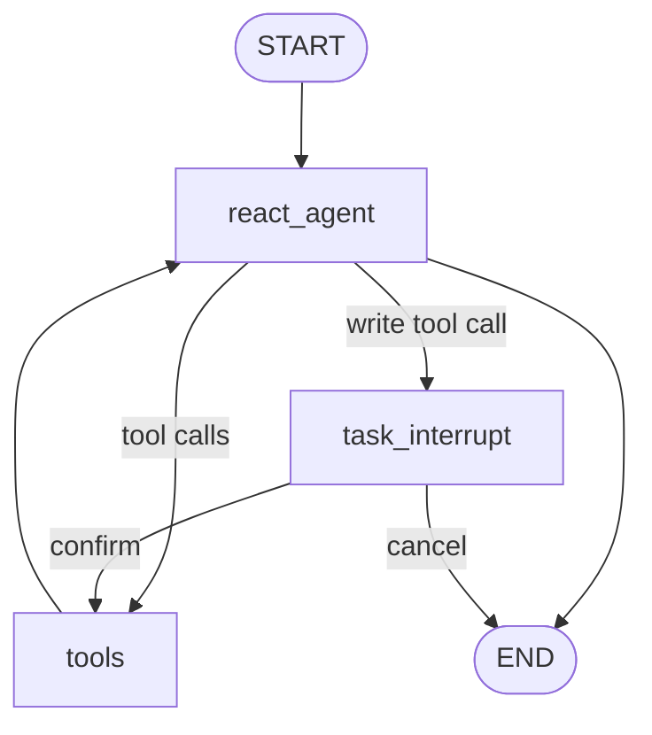

# ReAct Agent Architecture

## Overview

The ReAct agent node (`react_agent`) is responsible for generating
LLM responses that may include tool calls. Tool execution is performed
by a `ToolNode`. The graph separates decision-making (LLM / ReAct) from
side-effect execution (tools), and it includes an interrupt/confirmation
step for write operations to avoid unexpected state changes.

## Topology

## Workflow vs ReAct Agent
Most of the logic is similar to the [Workflow strategy](graph.md). It includes the same tools, state fields, checkpointing, and similar routing logic. The main differences are:

- The `react_agent` node is a single node that handles all intents and tool calls, rather than having separate nodes per intent.
- The `react_agent` node is responsible for emitting the daily briefing message at the start of the session, based on the `briefing_shown` state field. After the briefing is shown once, it should not be emitted again in the same session.
- The routing logic is simpler: a simpler `should_continue` function that checks for tool calls and write operations to the interrupt node for confirmation. Similarly, the `should_save` function only checks for confirmation or cancellation after an interrupt, rather than having separate edges per intent.
