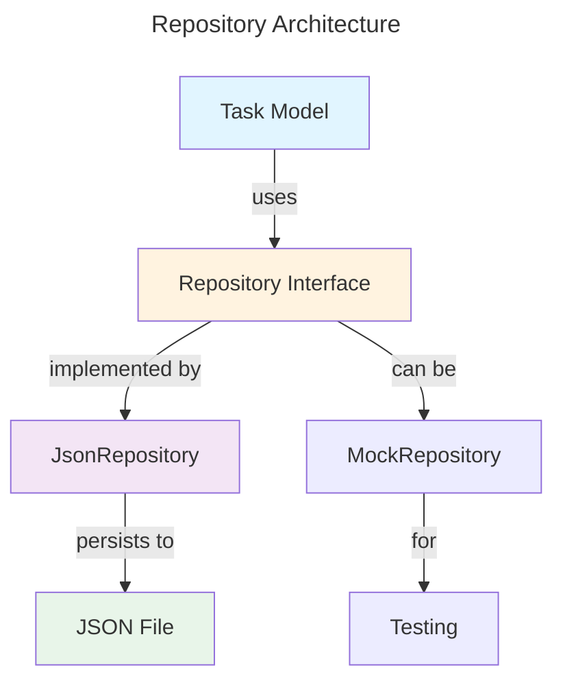

# Repository Pattern

This document describes the repository pattern used for data persistence in the Assistant Agent.

## Overview

The repository pattern provides a layer of abstraction between the domain models and the data access layer. This allows for:
- Flexible persistence strategies
- Easy testing with mock repositories
- Decoupling models from storage implementation
- Consistent data access patterns

## Architecture



## BaseRepository

The `BaseRepository` is an abstract interface defining the contract for all repository implementations.

### Interface

```python
class BaseRepository(ABC):
  @abstractmethod
  def save(self, task: Dict[str, Any]) -> None:
    """Persist a task to storage"""
    pass

  @abstractmethod
  def get(self, task_id: str) -> Dict[str, Any]:
    """Retrieve a task by ID"""
    pass

  @abstractmethod
  def list(self, query: Dict[str, Any] = None) -> List[Dict[str, Any]]:
    """Retrieve tasks with optional filtering"""
    pass
```

## JsonRepository

The `JsonRepository` is the primary implementation that persists tasks to JSON files.

### Initialization

```python
from assistant_agent.repository import JsonRepository

# Default: uses data/dump.json in project root
repo = JsonRepository()

# Custom root path
repo = JsonRepository(root_path="./custom_data")

# Custom file name
repo = JsonRepository(file_name="tasks.json")
```

### Features

- **Automatic directory creation**: Creates target directory if it doesn't exist
- **File initialization**: Creates empty JSON object if file doesn't exist
- **Flexible configuration**: Supports custom root paths and file names
- **Dictionary-based interface**: Works with dictionaries for compatibility (use `Task.to_dict()` and `Task.from_dict()` for conversion)

### Methods

#### `save(task: Dict[str, Any])`

Persists a task to the JSON file. Creates or overwrites the task using its `id` as the key.

```python
task_dict = {
  "id": "123e4567-e89b-12d3-a456-426614174000",
  "title": "Write Report",
  "description": "Q1 Report",
  "estimated_minutes": 120,
  "status": "pending",
  "created_at": "2026-04-01T10:30:00+00:00",
  "updated_at": "2026-04-01T10:30:00+00:00",
  "completed_at": None,
  "deadline": None,
  "planned_date": None
}

repo.save(task_dict)
```

#### `get(task_id: str)`

Retrieves a task by its ID. Raises `KeyError` if not found.

```python
task_dict = repo.get("123e4567-e89b-12d3-a456-426614174000")
```

#### `list(query: Dict[str, Any] = None)`

Retrieves all tasks, optionally filtered by query criteria.

```python
# Get all tasks
all_tasks = repo.list()

# Filter by status
pending = repo.list({"status": "pending"})

# Filter by multiple criteria
completed_by_user = repo.list({"status": "completed", "title": "Write Report"})
```

## Dependency Injection

The repository is injected into models . This provides:
- **Testability**: Easy to mock for unit tests
- **Flexibility**: Can switch implementations at runtime
- **Isolation**: No shared state between tests

### Setting the Repository

```python
from assistant_agent.models.task import Task
from assistant_agent.repository import JsonRepository

# In your application initialization
def setup():
    repo = JsonRepository(file_name="tasks.json")
    Task.set_repository(repo)

# Call once on startup
setup()
```

### Working Without Repository

Models work without a repository (useful for testing without persistence):

```python
from assistant_agent.models.task import Task

# Ensure no repository is set
Task.set_repository(None)

# Create and update tasks without persistence
task = Task.create(title="Task")
updated = task.update(title="Updated")
```

## File Format

Tasks are stored as a JSON object with task IDs as keys:

```json
{
  "123e4567-e89b-12d3-a456-426614174000": {
    "id": "123e4567-e89b-12d3-a456-426614174000",
    "title": "Write Report",
    "description": "Q1 Report",
    "estimated_minutes": 120,
    "status": "pending",
    "created_at": "2026-04-01T10:30:00+00:00",
    "updated_at": "2026-04-01T10:30:00+00:00",
    "completed_at": null,
    "deadline": null,
    "planned_date": null
  },
  "987f6543-a21c-45d6-e789-123456789abc": {
    "id": "987f6543-a21c-45d6-e789-123456789abc",
    "title": "Code Review",
    "description": null,
    "estimated_minutes": 30,
    "status": "completed",
    "created_at": "2026-03-30T14:15:00+00:00",
    "updated_at": "2026-04-01T09:00:00+00:00",
    "completed_at": "2026-04-01T09:30:00+00:00",
    "deadline": null,
    "planned_date": null
  }
}
```
